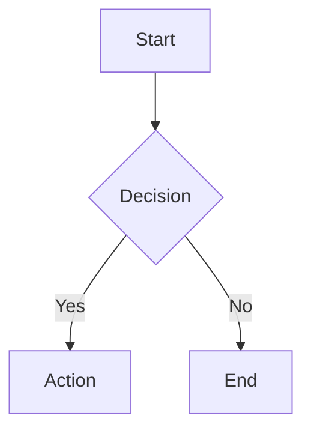

# Mermaid Beautify

把 Markdown/HTML 文件里裸露的 ` ```mermaid ` 代码块,转换成「隐藏源码 + 精美渲染图」的组合:

- 原始 mermaid 源码按原样藏在 `<div hidden>` 容器中 —— 不用 `<!-- -->` HTML 注释,因为两个不可调和的问题:(1) mermaid 的 `-->` 箭头恰好是 HTML 注释闭合标记;(2) 反引号围栏在注释内会被 Markdown 解析器抢先拆分。`<div hidden>`(HTML5 hidden 属性)浏览器零渲染,内容不受 HTML 或 Markdown 解析干扰,源码原样保留。
- 注释后面紧跟渲染结果:默认是内联 `<svg>...</svg>`(可选 15 套内置主题),或者(`--format ascii`)是包含 Unicode 方框字符的代码块,适合终端/纯文本场景。

底层引擎是 [beautiful-mermaid](https://github.com/lukilabs/beautiful-mermaid):支持 flowchart / state / sequence / class / ER / xychart 六种图,纯 TypeScript、零 DOM 依赖、同步渲染。

## 运行方式

`scripts/transform.ts` 是一个**自包含的 Bun 脚本**,没有 `package.json`/`node_modules`。通过 Bun 的 fallback 自动安装机制按需拉取并缓存 `beautiful-mermaid`(首次运行稍慢,之后走缓存):

```bash
bun run --install=fallback /home/stark/.agents/skills/mermaid-beautify/scripts/transform.ts <file|-> [options]
```

### 选项

| 选项 | 说明 | 默认值 |
|------|------|--------|
| `--format svg\|ascii` | 渲染输出格式 | `svg` |
| `--theme <name>` | beautiful-mermaid 内置主题名(见下表) | 库默认(`bg:#FFFFFF` / `fg:#27272A`) |
| `--output <file>` | 写入指定文件,而不是 stdout | 输出到 stdout |
| `--write` | 原地覆写输入文件 | 否 |
| `--force` | 重新渲染**已经转换过**的代码块(用于切主题或 svg↔ascii 互转) | 否,已转换的块默认跳过 |

`<file>` 传 `-` 时从 stdin 读取,结果输出到 stdout(此时不能用 `--write`)。

### 内置主题

`zinc-light` `zinc-dark` `tokyo-night` `tokyo-night-storm` `tokyo-night-light` `catppuccin-mocha` `catppuccin-latte` `nord` `nord-light` `dracula` `github-light` `github-dark` `solarized-light` `solarized-dark` `one-dark`

## 典型工作流

1. 确定目标文件和期望的输出格式/主题。
2. **先不带 `--write`/`--output` 跑一次**,把结果输出到 stdout 预览,确认渲染正常、没有错误。
3. 确认无误后,用 `--write`(原地覆盖)或 `--output <new-file>`(写到新文件)落盘。修改已有文件前,按惯例向用户展示一下 diff/摘要再写回。
4. 如果之后想换主题或在 svg/ascii 之间切换,对同一文件再跑一次并加上 `--force`——已转换的块会用其中保存的原始 mermaid 源码重新渲染,不会丢失/重复包裹。

## 转换示例

转换前:

````markdown

````

转换后(`--format svg`,默认主题):

````markdown
<div hidden>
graph TD
  A[Start] --> B{Decision}
  B -->|Yes| C[Action]
  B -->|No| D[End]
</div>

<svg xmlns="http://www.w3.org/2000/svg" ...>...</svg>
````

转换后(`--format ascii`):

````markdown
<div hidden>
graph TD
  A[Start] --> B{Decision}
  B -->|Yes| C[Action]
  B -->|No| D[End]
</div>

```
┌──────────┐
│  Start   │
└─────┬────┘
      ▼
◇──────────◇
│ Decision │
◇──────────◇
  ...
```
````

## 限制与注意事项

- 只识别**独占一行的 3 个反引号** ` ```mermaid ` 围栏代码块;缩进代码块(例如列表项内嵌的 mermaid)不支持。
- ASCII 输出固定 `colorMode: 'none'`(无 ANSI 颜色),保证能直接嵌进 Markdown 代码块。
- 单个代码块渲染失败(mermaid 语法错误)不会中断整体处理:该块原样保留,错误连同行号打印到 stderr,整体以非零退出码结束,方便定位修复。
- 重复运行是安全的(幂等):已转换的块默认跳过;需要更新时显式加 `--force`。
